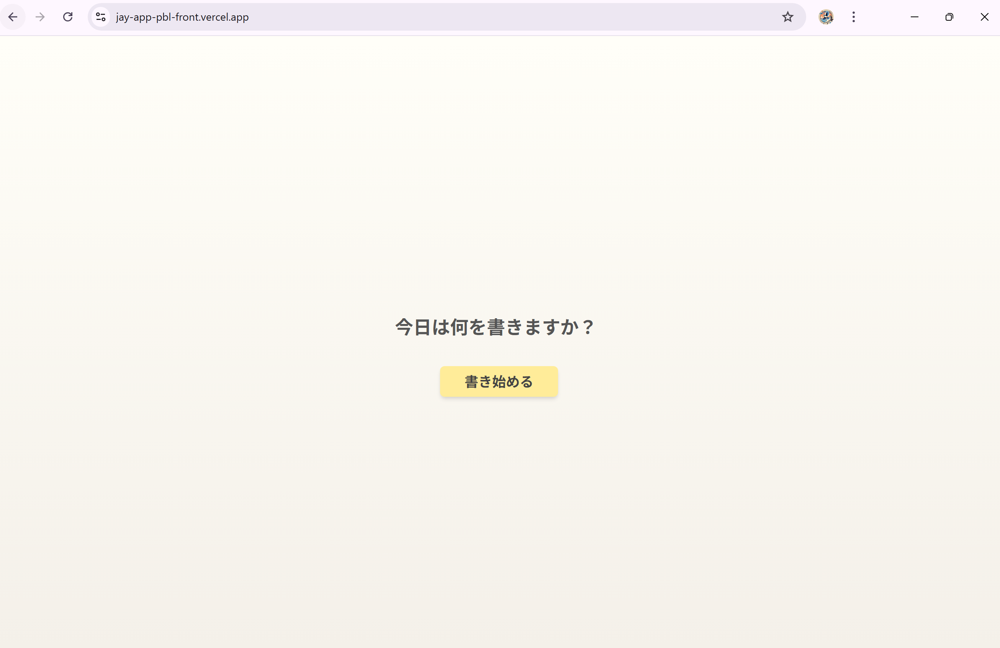
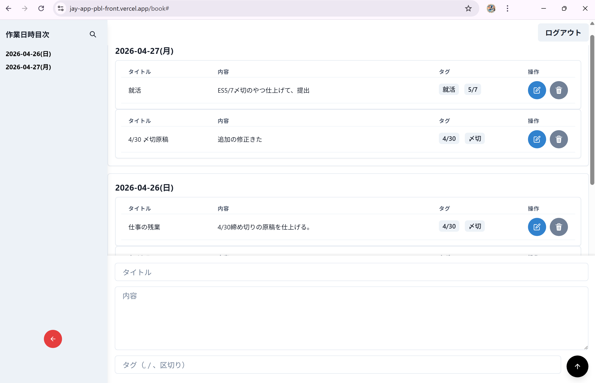
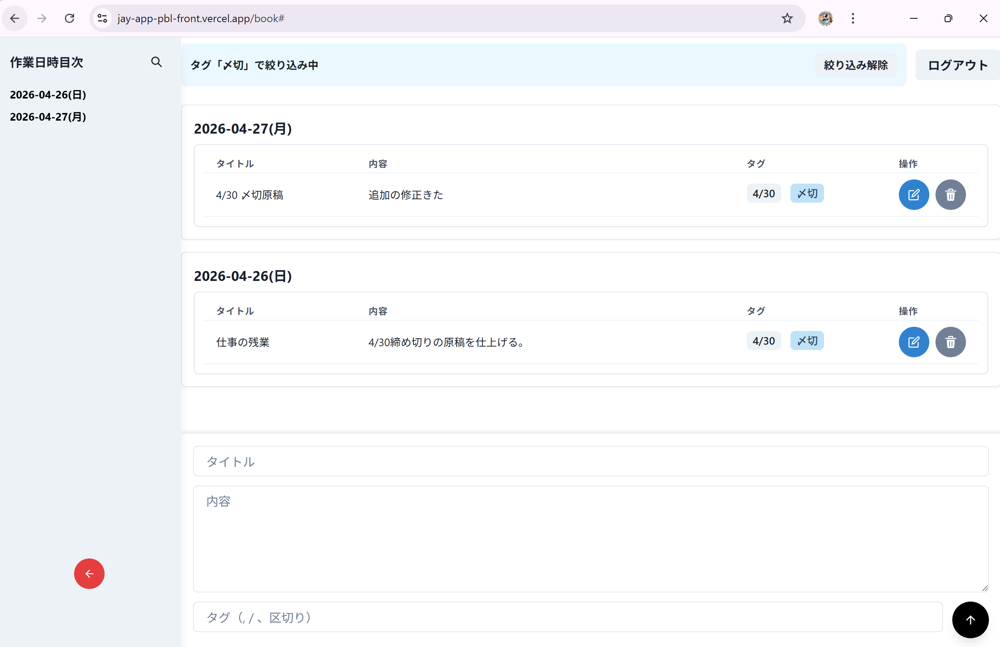
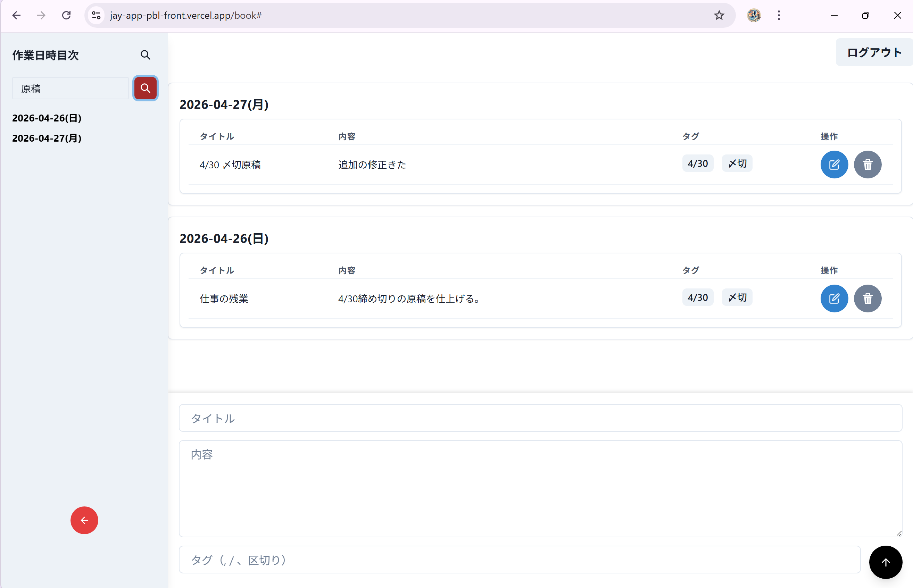
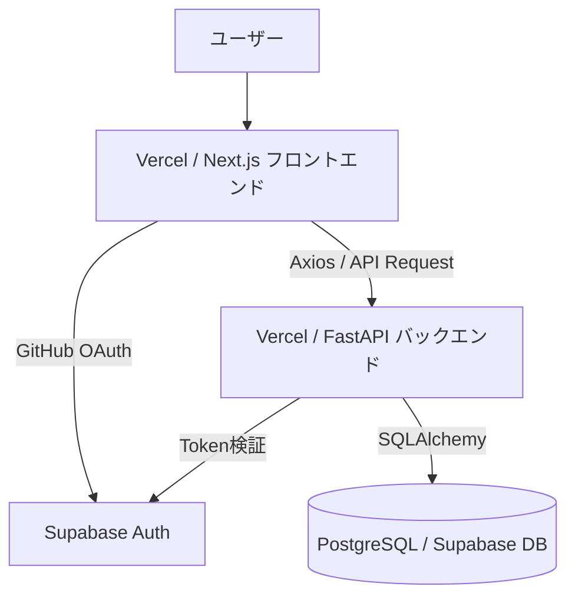
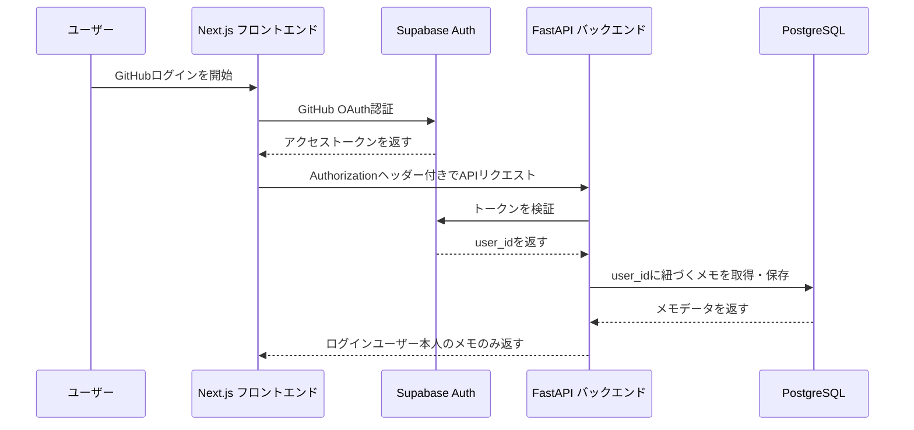
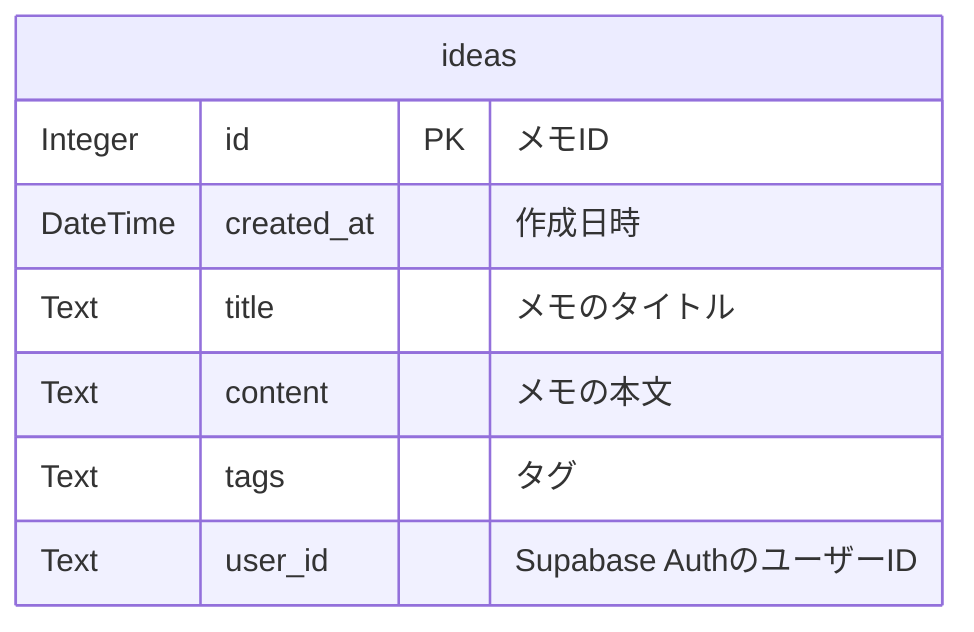

# 日付・タグ・検索で整理できるメモアプリ

メモが増えても、日付・タグ・検索機能によって必要な情報をあとから見つけやすくするWebアプリです。

メモは書くだけではなく、あとから見返して活用できることが重要だと考えました。
そこで、作成日ごとの整理、タグによる分類、キーワード検索機能を実装し、過去に書いた内容を思い出しやすくすることを目的に開発しました。

---

## 本番URL

https://jay-app-pbl-front.vercel.app

---

## 関連リポジトリ

- フロントエンド: https://github.com/JayMin0227/jay-app-pbl-front
- バックエンド: https://github.com/JayMin0227/jay-app-pbl-back

---

## デモ

### トップ画面



### メモ一覧画面（日付ごとの整理）



### タグを使ったメモ分類



### キーワード検索



---

## 使用技術

### フロントエンド

- TypeScript
- Next.js
- React
- Chakra UI
- Recoil
- Axios
- Supabase JavaScript Client

### バックエンド

- Python
- FastAPI
- SQLAlchemy
- PostgreSQL
- Supabase Auth

### インフラ・その他

- Vercel
- GitHub
- Supabase

---

## 主な機能

- GitHubアカウントによるログイン
- メモの作成
- メモの一覧表示
- メモの編集
- メモの削除
- 作成日ごとのメモ整理
- タグによるメモ分類
- キーワード検索によるメモの絞り込み
- ログインユーザーごとのメモ管理

---

## このアプリで解決したい課題

メモは書く量が増えるほど、「いつ・どこに・何を書いたか」を忘れやすくなります。
その結果、過去に書いた内容を探すのが面倒になり、メモをうまく活用できなくなると考えました。

このアプリでは、日付・タグ・検索機能を組み合わせることで、増えたメモの中から必要な情報をあとから見つけやすくすることを目指しました。

---

## システム構成図



認証には Supabase Auth を利用しています。



---

## ER図



---

## DB設計

### ideas テーブル

| カラム名 | 型 | 内容 |
|---|---|---|
| id | Integer | メモID |
| created_at | DateTime | 作成日時 |
| title | Text | メモのタイトル |
| content | Text | メモの本文 |
| tags | Text | タグ |
| user_id | Text | Supabase AuthのユーザーID |

---

## 技術選定の理由

### Next.js / React / TypeScript

メモの作成・検索・編集・削除など、画面上で状態が変わる機能が多いため、コンポーネント単位でUIを作れるReactを使用しました。
また、TypeScriptを使うことで、メモデータの型を明確にし、開発中のミスを減らすことを意識しました。

### Chakra UI

ボタンや入力欄などのUI部品を効率よく実装するために使用しました。
見た目を一からCSSで作り込むよりも、機能実装と画面の使いやすさに集中できると考えました。

### FastAPI

メモの作成・取得・検索・編集・削除をAPIとして提供するために使用しました。
PythonでシンプルにAPIを定義でき、バックエンド初心者でも処理の流れを理解しやすい点が理由です。

### Supabase Auth

GitHubログインを自前で実装すると、認証やセキュリティの考慮が必要になります。
そのため、Supabase Authを利用し、GitHub OAuth認証とユーザー情報の取得を安全に実装しました。

### PostgreSQL / SQLAlchemy

メモを永続化するためにPostgreSQLを使用しました。
SQLAlchemyを使うことで、PythonのコードからDB操作を行いやすくし、ユーザーごとのメモ取得や検索処理を実装しました。

---

## 工夫した点

### メモを「書く」だけでなく「思い出す」ことを重視した点

単にメモを保存するだけでは、メモが増えたときに目的の情報を探しづらくなります。
そのため、作成日ごとの表示、タグ管理、キーワード検索を組み合わせ、あとから必要なメモを見つけやすくしました。

### ログインユーザーごとにメモを分離した点

Supabase Authで取得したユーザー情報をバックエンド側で確認し、ログインユーザー本人のメモだけを取得・操作できるようにしました。

### フロントエンドとバックエンドを分けた点

画面表示はNext.js、データ操作はFastAPIに分けることで、フロントエンドとバックエンドの役割を分離しました。

---

## 苦労した点

### 認証情報をバックエンドで検証する流れの理解

#### 課題

フロントエンドでGitHubログインした後、バックエンド側で「誰がログインしているのか」を判定する方法が最初は分かりませんでした。

#### 原因

ログイン処理はフロントエンドのSupabase Authで行っていましたが、メモの取得や作成はFastAPI側で行うため、フロントエンドとバックエンドの間で認証情報をどう受け渡すかを理解する必要がありました。

#### 解決策

フロントエンドからバックエンドへリクエストを送る際に、AuthorizationヘッダーにBearer tokenを付け、FastAPI側でSupabase Authに問い合わせてユーザー情報を取得する設計にしました。

#### 学び

認証はログイン画面だけで完結するものではなく、バックエンドでデータを操作するときにも本人確認が必要だと学びました。

---

### メモをユーザーごとに分離する設計

#### 課題

ログイン機能を追加しただけでは、すべてのユーザーのメモが同じように扱われてしまう可能性がありました。

#### 原因

メモデータに「誰のメモか」を表す情報がなければ、ログインユーザーごとにデータを分けることができないためです。

#### 解決策

ideasテーブルに user_id を持たせ、バックエンド側でログイン中のユーザーIDに紐づくメモだけを取得・作成・編集・削除するようにしました。

#### 学び

認証とデータベース設計は別々ではなく、ユーザーごとに安全にデータを扱うために一緒に考える必要があると学びました。

---

## 今後の改善点

- タグを文字列ではなく専用テーブルで管理する
- メモのお気に入り機能を追加する
- 検索条件をタグ・日付ごとに細かく指定できるようにする
- UIをスマートフォンでもさらに見やすくする
- テストコードを追加する

---

## ローカル環境での起動方法

### 1. リポジトリをクローン

```bash
git clone https://github.com/JayMin0227/jay-app-pbl-front.git
cd jay-app-pbl-front
```

### 2. パッケージをインストール

```bash
npm install
```

または

```bash
yarn install
```

### 3. 環境変数を設定

`.env.local` を作成し、以下を設定します。

```env
NEXT_PUBLIC_SUPABASE_URL=https://<project-ref>.supabase.co
NEXT_PUBLIC_SUPABASE_ANON_KEY=<supabase-anon-public-key>
NEXT_PUBLIC_API_URL=https://<your-backend-url>
```

※ メモの取得・作成・編集・削除を行うには、バックエンドAPIも起動している必要があります。
バックエンドの起動方法は、バックエンドリポジトリのREADMEを参照してください。


### 4. 開発サーバーを起動

```bash
npm run dev
```

または

```bash
yarn dev
```

### 5. ブラウザで確認

```text
http://localhost:3000
```

---

## 作成者

JayMin0227